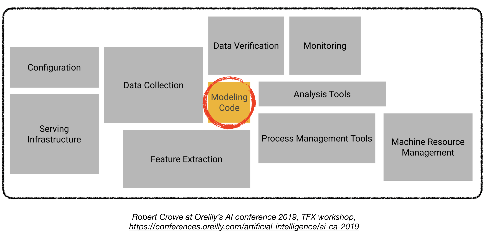

#   4. 机器学习系统设计

||
| --- |
| 1. [机器学习系统设计的 9 步公式](#1-the-9-step-ml-system-design-formula-template) |
| 2. [机器学习系统设计示例题](#2-ml-system-design-sample-questions) |
|3. [机器学习系统设计主题](#3-ml-system-design-topics)|
|4. [大厂中的机器学习](#4-ml-at-big-tech-companies)|
| 5.  [智能体 AI 系统设计（2025）](https://github.com/alirezadir/Agentic-AI-Systems.git)|
||

### 面向生产环境的机器学习系统设计

将深度学习模型部署到生产环境中往往很有挑战，而且这远不只是训练出一个性能不错的模型。要构建一个生产级深度学习系统，还需要设计和开发多个彼此独立的组件。

机器学习系统设计问题与通用软件系统设计的思考路径相似。如果你想进一步了解通用系统设计面试，可以参考 [Grokking the System Design Interview](https://www.educative.io/courses/grokking-the-system-design-interview) 和 [System Design Primer](https://github.com/donnemartin/system-design-primer)。不过，设计机器学习系统时还必须单独考虑并重点关注一些特定组件，具体如下文的机器学习系统设计流程所示。

### 机器学习系统设计面试

- 在机器学习系统设计面试中，你会面对开放式问题，这类问题通常没有唯一正确答案。
- 机器学习系统设计面试的目标，是评估你是否具备从更高层次出发，设计一个可作为服务部署在公司机器学习基础设施中的生产级机器学习系统的能力。

# 1. 机器学习系统设计的 9 步公式（[模板](./mlsd-template.md)）

为了给真实世界应用设计一个扎实的机器学习系统，遵循一套设计流程非常重要。
我建议使用下面这套**机器学习系统设计 9 步公式**，来为与机器学习相关的业务问题设计软件系统方案，无论是在工作中还是在面试中都适用：

<!-- 

 -->

| | |
| --- | ---|
| 第 1 步| [问题定义](#1-problem-formulation) |
| 第 2 步 |[指标（离线与在线）](#2-metrics-offline-and-online) |
| 第 3 步 |[架构组件（MVP 逻辑）](#3-architectural-components-mvp-logic)|
| 第 4 步 |[数据收集与准备](#4-data-collection-and-preparation) |
| 第 5 步 |[特征工程](#5-feature-engineering) |
| 第 6 步 |[模型开发与离线评估](#6-model-development-and-offline-evaluation) |
| 第 7 步 |[预测服务](#7-prediction-service) |
| 第 8 步 |[在线测试与模型部署](#8-online-testing-and-model-deployment)  |
| 第 9 步 |[扩展、监控与更新](#9-scaling-monitoring-and-updates) |
| | |

注意：在面试中使用这套设计流程时，要保持灵活。根据面试的需求或面试官的兴趣点，你可以跳过其中某些部分，或者对一两个部分做更深入的展开。  

## 1. 问题定义

- 澄清性问题
- 使用场景与业务目标
- 需求
  - 范围（需要哪些功能）、规模，以及个性化程度
  - 性能：预测延迟、预测规模
  - 约束条件
  - 数据：来源与可用性  
- 假设

- 将抽象问题转化为机器学习问题
  - 机器学习目标，
  - 机器学习输入/输出，
  - 机器学习任务类别（例如二分类、多分类、无监督学习等）
- 我们是否真的需要用机器学习来解决这个问题？
  - 影响与成本之间的权衡
    - 成本：数据收集、数据标注、算力
    - 如果需要，就设计机器学习系统；如果不需要，就走通用系统设计流程。  
    - 注意：在机器学习系统设计面试中，我们通常可以默认需要用到机器学习。

## 2. 指标（离线与在线）

- 离线指标（例如分类指标、相关性指标）  
  - 分类指标
    - 精确率、召回率、F1、ROC AUC、P/R AUC、mAP、log-loss 等
      - 数据不平衡
  - 检索与排序指标
    - Precision@k、Recall@k（不考虑排序质量）
    - mAP、MRR、nDCG
  - 回归指标：MSE、MAE、 
  - 问题特定指标
    - 语言：BLEU、BLEURT、GLUE、ROUGE 等 
    - 广告：CPE 等  
  - 延迟
  - 计算成本（尤其是端侧场景）
- 在线指标
  - CTR
  - 任务/会话成功率或失败率，
  - 任务/会话总时长（例如观看时长），
  - 互动率（点赞率、评论率）
  - 转化率
  - 收入提升 
  - 首次点击倒数排名等，
  - 对冲指标：直接负反馈（隐藏、举报）
- 指标之间的权衡

## 3. 架构组件（MVP 逻辑）

- 高层架构与主要组件
  - 非机器学习组件：
    - 用户、应用服务器、数据库、知识图谱等，以及它们之间的交互
  - 机器学习组件：
    - 建模模块（例如候选生成器、排序器等）
    - 训练数据生成器  
    ... 
- 模块化架构设计
    - 模型 1 架构（例如候选生成）
    - 模型 2 架构（例如排序器、过滤器）
    - ...

## 4. 数据收集与准备  

- 数据需求
  - 目标变量
  - 主要参与者信号（例如用户、物品等）
  - 类型（例如图像、文本、视频等）与数据量
- 数据来源
  - 可用性与成本
  - 隐式数据（日志）、显式数据（例如用户调研）
- 数据存储
- 机器学习数据类型
  - 结构化数据 
    - 数值型（离散、连续）
    - 类别型（有序、无序），
  - 非结构化数据（例如图像、文本、视频、音频）
- 标注（监督学习场景）
  - 标注方法
    - 自然标签（从数据中提取，例如点击、点赞、购买等）
      - 缺失负标签（不点击并不等于负标签）：
        - 负采样
    - 显式用户反馈
    - 人工标注（成本极高、速度慢、存在隐私问题）
  - 缺少标签时如何处理
  - 程序化标注方法（有噪声；优点：成本低、隐私更友好、适应性强）
    - 半监督方法（从一个较小的初始标注集出发，例如基于扰动的方法）
    - 弱监督（编码启发式规则，例如关键词、regex、db、其他机器学习模型的输出）
  - 迁移学习：
    - 先在廉价的大规模数据上预训练（例如 GPT-3），
    - 然后对下游任务做 zero-shot 或微调  
  - 主动学习
  - 标注成本与权衡
- 数据增强
- 数据生成流水线 
  - 数据收集/摄取（离线、在线）
  - 特征生成（下一节）
  - 特征变换
  - 标签生成
  - Joiner

## 5. 特征工程

- 特征选择
  - 定义主要参与者（例如用户、物品、文档、查询、广告、上下文），
  - 定义参与者特定特征（当前特征、历史特征）
    - 用户特征示例：用户画像、用户历史、用户兴趣 
    - 文本特征示例：n-grams（uni、bi）、意图、主题、频次、长度、嵌入向量   
  - 定义交叉特征（例如 user-item，或 query-document 特征）
    - query-document 特征示例：tf-idf
    - user-item 特征示例：用户视频观看历史、用户搜索历史、用户广告交互（浏览、点赞）
  - 隐私约束
- 特征表示
  - One-hot 编码
  - 嵌入向量
    - 例如用于文本、图像、图、用户（如何构建）、商店等
    - 如何生成/学习？
    - 预计算并存储
  - 类别特征编码（one-hot、有序编码、计数编码等）
  - 位置嵌入向量
  - 缩放/归一化（数值特征）
- 特征预处理 
  - 非结构化数据通常需要预处理 
    - 文本：分词（tokenization）（归一化、预分词、分词器模型（字符/词/子词级别）、后处理（添加特殊 token））
    - 图像：调整尺寸、归一化
    - 视频：解码帧、采样、调整尺寸、缩放与归一化
- 缺失值
- 特征重要性
- Featurizer（原始数据 -> 特征）
- 静态特征（来自特征存储）vs 动态特征（在线计算） 
  
## 6. 模型开发与离线评估

- 模型选择（MVP）
  - 启发式规则 -> 简单模型 -> 更复杂模型 -> 模型集成
    - 优缺点与决策
    - 注意：始终从尽可能简单的方案开始（KISS），然后持续迭代
    <!-- - 关于模型选择的更多内容（待补充） -->
  - 常见建模选择： 
    - 逻辑回归 
    - 决策树变体
      - GBDT（XGBoost）和 RF 
    <!-- - SVM -->
    - 神经网络 
      - FeedForward 
      - CNN
      - RNN 
      - Transformers
  - 决策因素 
    - 任务复杂度 
    - 数据：数据类型（结构化、非结构化）、数据量、数据复杂度 
    - 训练速度 
    - 推理要求：算力、延迟、内存 
    - 持续学习  
    - 可解释性 
  - [常见神经网络架构](./mlsd-modeling-popular-archs.md)
    
- 数据集 
  - 采样
    - 非概率采样
    - 概率采样方法
      - 随机采样、分层采样、水库采样、重要性采样
  - 数据集划分（train、dev、test）
    - 划分比例
    - 对时间相关数据的划分（按时间切分）
      - 季节性、趋势  
    - 数据泄漏：
      - 先切分再缩放，
      - 统计量、缩放参数和缺失值处理只能基于训练集

  - 类别不平衡 
    - 重采样
    - 加权损失函数
    - 合并类别  

- 模型训练 
  - 损失函数 
    - MSE、Binary/Categorical CE、MAE、Huber loss、Hinge loss、Contrastive loss 等
  - 优化器
    - SGD、AdaGrad、RMSProp、Adam 等
  - 模型训练 
    - 从零训练或微调  
  - 模型验证  
  - 调试 <!-- - 关于调试的更多内容（待补充） -->
  - 离线训练 vs 在线训练  

  - 模型离线评估

  - 超参数调优 
    - 网格搜索 

  - 迭代优化 MVP 模型
      - 模型选择
      - 数据增强
      - 模型更新频率
  - 模型校准

## 7. 预测服务

- 数据处理与校验
- Web 应用与服务系统
- 预测服务
- 批量预测 vs 在线预测
  - 批量：周期性执行，预计算并存储，需要时直接读取——高吞吐
  - 在线：请求到达时即时预测——低延迟
  - 混合：例如 Netflix，标题用批量，行用在线
- 最近邻服务
  - 近似 NN 
    - 基于树、LSH、基于聚类 
- 边缘侧机器学习（端侧 AI）
  - 网络连接/延迟、隐私、低成本
  - 内存、算力、能耗约束  
  - 模型压缩
    - 量化
    - 剪枝
    - 知识蒸馏
    - 分解

## 8. 在线测试与模型部署

- A/B 实验
  - 如何做 A/B 测试？
    - 用户抽样比例是多少？
    - 对照组与实验组
    - 零假设
- Bandit
- 影子部署
- 金丝雀发布

## 9. 扩展、监控与更新

- 应对需求增长的扩展（与分布式系统类似）
  - 通用软件系统扩展（分布式服务器、负载均衡、分片、副本、缓存等）
    - 训练数据 / 知识库分区
  - 机器学习系统扩展
    - 分布式机器学习 
      - 数据并行（用于训练）
      - 模型并行（用于训练、推理）
        - 异步 SGD 
        - 同步 SGD 
    - [分布式训练]()
      - Data parallel DT、RPC based DT   
    - 扩展数据收集 
      - [MT for 1000 languages](https://arxiv.org/abs/2205.03983)
      - [NLLB](https://research.facebook.com/publications/no-language-left-behind/)
    - 监控、容错、更新（见下文）
    - Auto ML（软：超参数调优，硬：架构搜索（NAS））
- 监控：
  - 日志
    - 特征、预测、指标、事件
  - 监控指标
    - 软件系统指标
    - 机器学习指标（与准确性相关、预测、特征）
      - 在线与离线指标看板  
  - 监控数据分布漂移
    - 类型：协变量漂移、标签漂移、概念漂移
    - 检测（统计方法、假设检验）
    - 修正
- 系统故障
  - 软件系统故障
    - 依赖、部署、硬件、宕机
  - 机器学习系统故障
    - 数据分布差异（测试集 vs 线上）
    - 反馈回路
    - 边界情况（例如无效/垃圾输入）
    - 数据分布变化
  - 告警
    - 故障（数据流水线、训练、部署）、指标过低等
- 更新：持续训练
  - 模型更新
    - 从零训练，或基于基础模型训练
    - 多久更新一次？每天、每周、每月等
  - 自动更新模型 
  - 主动学习 
  - Human in the loop 机器学习  

### 其他主题：

- 扩展： 
  - 在基础设计上迭代，增加新的功能特性 
- 训练数据中的偏差
  - 人工标注引入的偏差 
- 新鲜度、多样性
- 隐私与安全 

# 2. 机器学习系统设计示例题
下面是机器学习工程面试中最常见的机器学习系统设计题： 

### 生成式 AI / LLM 系统（2026）
> 这类题目越来越常见，通常会作为**独立一轮**出现（常被称为 *GenAI / LLM system design*）。同样适用上述 9 步公式，只是需要从 GenAI 视角来思考——见下文 [§ GenAI / LLM 系统设计](#genai--llm-system-design-2026) 和 [Agentic AI Systems repo](https://github.com/alirezadir/Agentic-AI-Systems.git)。
- **RAG 文档问答 / “chat with your docs”**（检索 + 基于上下文的生成）
- **LLM 驱动的客服聊天机器人**（带 guardrails，必要时回退到人工）
- **智能体工作流 / AI 助手**（规划、工具使用、记忆）
- **企业级 / 语义搜索 + LLM 答案**（检索 + 综合生成 + 引用）
- **代码助手 / coding agent**（基于代码仓库的 RAG + 工具使用 + 校验）
- **大规模内容生成 / 摘要**（批处理 + 安全过滤）
- **基于 LLM 的推荐 / 个性化**（LLM 作为排序器或特征生成器）

### 推荐系统
- **[视频/电影推荐](./mlsd-video-recom.md)**（Netflix、Youtube）
- **[好友 / 关注推荐](./mlsd-pymk.md)**（Facebook、Twitter、LinkedIn）
- **[活动推荐系统](./mlsd-event-recom.md)**（Eventbrite）
- **[游戏推荐](./mlsd-game-recom.md)**
- **替代商品推荐**（Instacart）
- **租房推荐**（Airbnb）
- **地点推荐** 
  
### 搜索系统（检索、排序）
  - **文档搜索**
    - **[文本查询搜索](./mlsd-search.md)**（全文、语义），
    - **[图像/视频搜索](./mlsd-image-search.md)**， 
    - **[多模态搜索](./mlsd-mm-video-search.md)**（MM Query）
    <!-- - Semantic Search system  -->
### 排序系统
- **[信息流系统](./mlsd-newsfeed.md)**（排序）  
- **广告投放系统**（检索、排序）
  - **[广告点击预测](./mlsd-ads-ranking.md)**（排序）

### NLP
- **实体链接系统（NLP 标注、推理）**
- **自动补全 / 联想输入建议系统**
- **情感分析系统**
- **语言识别系统**
- **聊天机器人系统**
- **[问答系统]()**

### CV
  - **图像模糊处理系统**
  - **OCR/文本识别系统** 
  
### AV
- **自动驾驶汽车**
  - 感知、预测与规划
  - [行人闯红灯检测](./mlsd-av.md)
- **网约车匹配系统**

## 其他
- **邻近服务 / Yelp**
- **外卖配送时间估计**
- **有害内容 / 垃圾信息检测系统**
  - [多模态有害内容检测](./mlsd-harmful-content.md)  
  - 欺诈检测系统
- **医疗诊断系统**

# 3. 机器学习系统设计主题

我观察到，有一些主题经常在面试中被提到，或者可以作为系统设计逻辑的一部分使用。下面列出其中一些重要主题：

### 推荐系统

- 候选生成 
  - 协同过滤（CF）
    - 基于用户、基于物品
    - 矩阵分解
    - 双塔方案
  - 基于内容的过滤
- 排序 
- Learning to Rank（LTR）
  - point-wise（最简单）、pairwise、list-wise 

### 搜索与排序（广告、信息流等）

- 搜索系统 
  - 查询搜索（关键词搜索、[语义搜索](https://txt.cohere.ai/what-is-semantic-search/?utm_source=linkedin&utm_medium=paidsocial&utm_campaign=contentpromotion_bloglookalikes)） 
  - 视觉搜索 
  - 视频搜索 
  - 两阶段模型 
    - 文档选择
    - 文档排序 
- 排序 
  - 信息流排序系统
  - 广告排序系统 
  <!-- - Ranking by relevance -->
  - 将排序建模为分类任务 
  - 多阶段排序 + blender + 过滤器
  <!-- - Information Retrieval -->

### NLP

- 特征工程 
  - 预处理（分词）
- 文本嵌入向量
  - Word2Vec、GloVe、Elmo、BERT
- NLP 任务：
  - 文本分类
    - 情感分析
    - 主题建模
  - 序列标注  
    - 命名实体识别
    - 词性标注
      - POS HMM
      - Viterbi algorithm、beam search
  - 文本生成 
    - 语言建模
      - N-grams vs 深度学习模型（权衡）
      <!-- - 未登录词问题 -->
      - 解码

  - Sequence 2 Sequence 模型
    - 机器翻译
      - Seq2seq models、NMT、Transformers
  - 问答 
  - [进阶] 对话系统与聊天机器人
      - [CMU lecture on chatbots](http://tts.speech.cs.cmu.edu/courses/11492/slides/chatbots_shrimai.pdf)
      - [CMU lecture on spoken dialogue systems](http://tts.speech.cs.cmu.edu/courses/11492/slides/sds_components.pdf)
  
- 语音识别系统
    - 特征提取、MFCCs
    - 声学建模
      - 用于声学模型的 HMM
      - CTC algorithm（进阶）

### 计算机视觉

- 图像分类
  - VGG、ResNET
- [目标检测](https://viso.ai/deep-learning/object-detection/) 
  - 两阶段模型（R-CNN、Fast R-CNN、Faster R-CNN）
  - 单阶段模型（YOLO、SSD）
  - [Vision Transformer (ViT)](https://viso.ai/deep-learning/vision-transformer-vit/)
  - NMS 算法 
- 目标跟踪
<!-- - 常见架构（AlexNet、VGG、ResNET、R-CNN、YOLO） -->
 
### 图问题
- 你可能认识的人 
<!-- ### Personalization -->

### GenAI / LLM 系统设计（2026）

这是现代机器学习系统设计面试中最重要的新增内容。到 2026 年，*"evaluation methodology is the new system design"*——面试官相比架构图，更关心**成本、延迟、guardrails 和监控**。一个反复出现的核心视角是：要清楚**LLM 应该放在哪一层，以及哪些环节应该由确定性系统接管**。

- **知识 / 上下文策略**（核心权衡）：**RAG vs 微调 vs 长上下文 vs 工具/记忆**
  - 当知识规模大 / 变化快 / 需要引用时用 RAG；微调适用于行为、格式或领域风格；长上下文适用于整篇文档推理；实际中通常会组合使用（指令微调基础模型 + 轻量 LoRA + RAG）
- **RAG 流水线**（最常见模式）：
  - 摄取：**chunking**（大小/重叠，语义切分 vs 固定切分）、**嵌入模型**、**向量数据库 / ANN 索引**（HNSW、IVF-PQ）
  - 检索：稠密检索 vs **混合检索（dense + BM25/keyword）**、元数据过滤、**重排序**（cross-encoder）、query rewriting / HyDE
  - 生成：基于事实的提示词、**引用**、上下文窗口预算、处理“无答案”场景
  - 进阶：多跳 / 智能体式 RAG、GraphRAG、**缓存**（prompt/embedding/semantic cache）
- **智能体系统**：规划（ReAct、plan-and-execute）、**工具/function calling**、**记忆**（短期上下文、长期存储）、多智能体编排、**失败模式**（循环、幻觉出的工具、错误恢复）、human-in-the-loop
- **服务与扩展**：推理 API 设计、**KV cache**、连续批处理（vLLM）、**量化**、推测解码；模型路由（小模型 vs 大模型）、**自托管 vs API** 的权衡
- **可靠性（生产级 LLM 工程）**：限流、**重试 / 超时 / 幂等性**、回退、队列、**熔断器**、优雅降级
- **Guardrails 与安全**：输入/输出过滤、**prompt injection 与 jailbreak** 防护、PII 脱敏、事实依据/幻觉检查、内容审核、拒答处理
- **评估（重点强调！）**：构建**golden set**、**LLM-as-judge**、两两胜率、**RAG triad**（faithfulness、answer relevance、context relevance）、检索指标（recall@k、MRR、nDCG）、**离线评估 + 在线 A/B + 回归测试**，上线前必须做
- **成本与延迟**：token 核算、prompt/上下文优化、缓存、批处理、流式输出（TTFT vs 总延迟）、小模型路由
- **监控**：跟踪质量漂移、幻觉率、检索命中率、单请求延迟/成本、用户反馈回路；trace/可观测性（智能体每一步日志）

# 4. 大厂中的机器学习

在掌握基础之后，我强烈建议你去阅读不同公司的机器学习系统相关博客。你可以参考 [ML at Companies](ml-companies.md) 这一节中的一些资源。

# 更多资源

- 如果你想进一步了解上面提到的不同组件，可以参考以下资源）：
  - [Full Stack Deep Learning course](https://fall2019.fullstackdeeplearning.com/)
  - [Production Level Deep Learning](https://github.com/alirezadir/Production-Level-Deep-Learning)
  - [Machine Learning Systems Design](https://github.com/chiphuyen/machine-learning-systems-design)
  - [Stanford course on ML system design](https://online.stanford.edu/courses/cs329s-machine-learning-systems-design)
